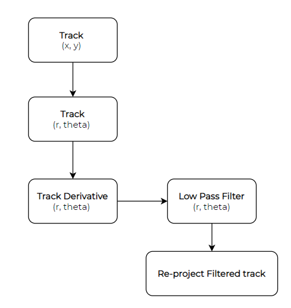
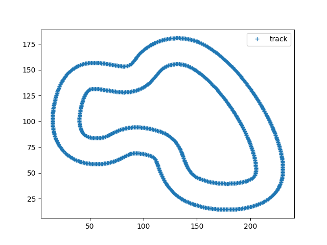
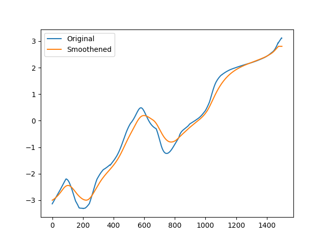
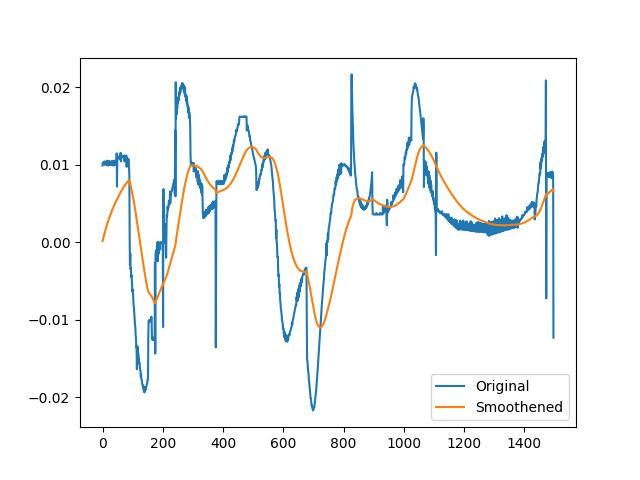
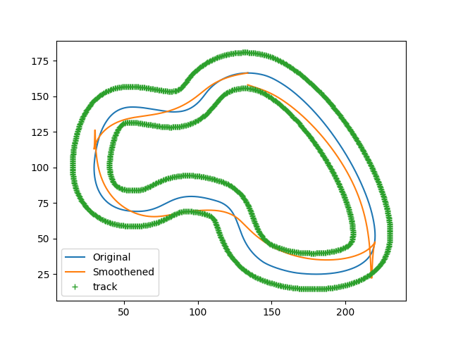

# Ideal Trajectory Generation using Track Smoothing

In a racing situation, we often need to try and get the optimal trajectory and follow it as accurately as possible in order to get the best lap times. Here, we try to use the information available as lane-lines and try to smoothen it in order to get the ideal race line.

### Algorithm

Some images of the process:

Track: 

Polar: 

Derivative of polar, and smoothening : 

Reprojection on track: 

There are some flaws with this method as we notice that the track is not ideal due to offset issues caused by the conversion between polar and cartesian coordinates. Although this can be corrected, it can be difficult to get an accurate estimate in real time. Hence, it cannot be used for dynamic tracks.